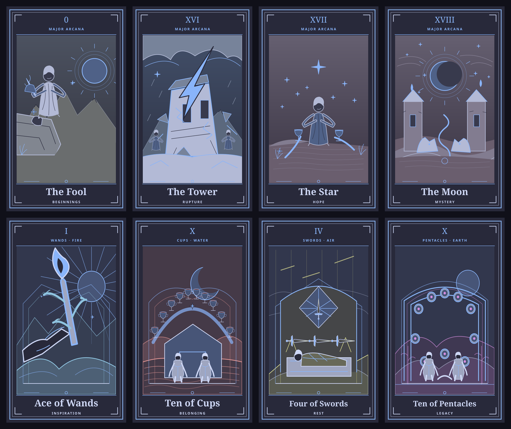

# Ominity


A daily tarot ritual for Omarchy. Click **✦** in the bar to draw a card. The artwork takes the whole stage; click the card to turn it over for its meaning, today's lens and symbol, a reflection prompt, a deeper reading, and a guide to tarot. Click outside the card or press **Esc** to put it away. Right-click the bar glyph to toggle a compact desktop card.

Ominity draws once per local day and keeps that card until you deliberately choose **Draw again**. Its 78 original vector illustrations are individual symbolic scenes: the Major Arcana move through distinct archetypal places, while the four Minor Arcana suits inhabit fire, water, air, and earth. Each image has layered light, figures, and small details to discover. The larger illustration occupies most of the card, and the celestial card back makes the draw feel like an object in your hands.

The current Omarchy theme colors the deck. A new Daily Om adds a few restrained marks shaped by coarse machine capacity and one-time activity buckets; the card, orientation, and interpretation remain independent of them. Ominity stores the finalized SVG and a lossless 1400 × 2400 PNG witness, so a historical card keeps the appearance it had when drawn. The static bundled plates remain a fallback. No account, network connection, or model is needed.

[View the complete original deck](docs/deck-sheet.png) and its [card back](docs/card-back.png).



The bar glyph opens the card; right-click toggles the optional desktop widget. Click the illustration to turn it over. On the reading side, **Art** returns to the illustration, **Deeper** expands the interpretation, **Tarot guide** explains the deck, and **Journal** keeps your own first impression and evening reflection. **Constellation** shows all 78 cards, factual card frequencies, 7/30/90-day views, dated artwork, and Machine Eras. **Space** turns the card and **Esc** closes it.

Each day's **Lens**, **Notice**, and **Carry this** text is selected from original card-specific writing and saved with that Daily Om. When a card returns, **The Thread** states the previous date and elapsed days from recorded history. Constellation percentages describe encounters, never predictions. A deliberate redraw changes the visible reading but does not change that day's canonical card or its lifetime statistics.

The deck uses the traditional [Rider–Waite–Smith structure](https://rider-waite.com/symbolism/pictorial-key-1-3/). Each card has an upright invitation, reversed angle, deeper interpretation, symbols, keywords, and a question. Research into Davide De Angelis’s *Starman Tarot* informed the broad themes of transformation and creative possibility ([Lo Scarabeo](https://www.loscarabeo.com/en/products/starman-tarot), [Schiffer](https://schifferbooks.com/products/starman-tarot-remastered-tarot-deck-and-guidebook-box-set)). Ominity’s art and text are original; it is unaffiliated with those creators or publishers.

## Install

On Omarchy, run:

```bash
omarchy plugin add https://github.com/0xQuan93/omarchy-ominity-plugin.git --enable
```

The plugin provides a bar widget and a persistent desktop service. Manage its bar position with Omarchy’s bar settings. To update or remove it:

```bash
omarchy plugin update oxquan.ominity
omarchy plugin remove oxquan.ominity
```

Removing the plugin leaves your private archive under `~/.local/state/ominity/` until you choose to delete it. Canonical draws live in `history/YYYY/YYYY-MM-DD.json`; content-addressed SVG/PNG artwork, Machine Era records, journal entries, and a bounded redraw log live alongside them. Theme variants under `~/.cache/ominity/decks/` can be deleted safely. New artwork requires `rsvg-convert` (from librsvg), Python 3, and Quickshell. The archive is offline and private to your account.

Ominity creates a random installation seed in `~/.local/state/ominity/identity.json` with mode `0600`; the seed and raw machine measurements never enter the archive. A private Machine Era state tracks coarse capacity periods and confirms a new period only after observations on three distinct local days. Earlier readings migrate into permanent history without claiming that their original artwork was witnessed. The versioned storage and artwork contracts are in the [Living Deck RFC](docs/LIVING-DECK.md).

### Portable archive

In **Constellation → Archive**, choose **Export** to make a verified, self-contained ZIP in your Documents folder, or **Import** and enter the path to an existing ZIP. Import verifies the manifest, member hashes, paths, records, artwork, and Machine Era references before publishing anything. Conflicting Daily Oms or artwork stop the import; conflicting local journal text stays local. The ordinary archive omits the private installation seed, so another computer begins its own Machine Era. Full archives are supported; incremental archive chains are not yet implemented.

The same operations are available through `python3 ominity.py archive-export --path /path/to/Ominity.zip`, `archive-verify`, and `archive-import`. Journal text is sent to the local process on standard input, not as a command argument.

## Optional local summary

An optional executable at `~/.config/ominity/summary` can provide a companion reflection. **Ask Zephyr** appears only when the adapter exists and runs only when clicked. The adapter reads the current card and selected reflective context, omits machine telemetry, and returns one JSON object with `ok`, the same `drawnAt` stamp, and a `summary` string. Ominity ignores summaries for an older draw. The published plugin does not include a model, account integration, or private companion state.

Tarot here is a reflective practice: an image can prompt attention and choice, not establish facts or predict a fixed outcome.

## Development

`python3 -B deck/build_deck.py` regenerates the bundled SVG plates. `python3 -B -m unittest discover -s tests` checks storage, drawing, archive, and journal behavior; `python3 -B -m unittest deck.test_deck deck.test_theme_deck deck.test_living_art` checks content and art. `omarchy plugin validate .` checks the manifest and entry points. `/usr/lib/qt6/bin/qmlformat -n Desktop.qml` (and the same for `CardOverlay.qml`, `Constellation.qml`, `HistoryDetail.qml`, and `BarWidget.qml`) parses QML. Live rendering on Omarchy is the final UI check.

License: MIT. See [LICENSE](LICENSE) and the [changelog](CHANGELOG.md).
