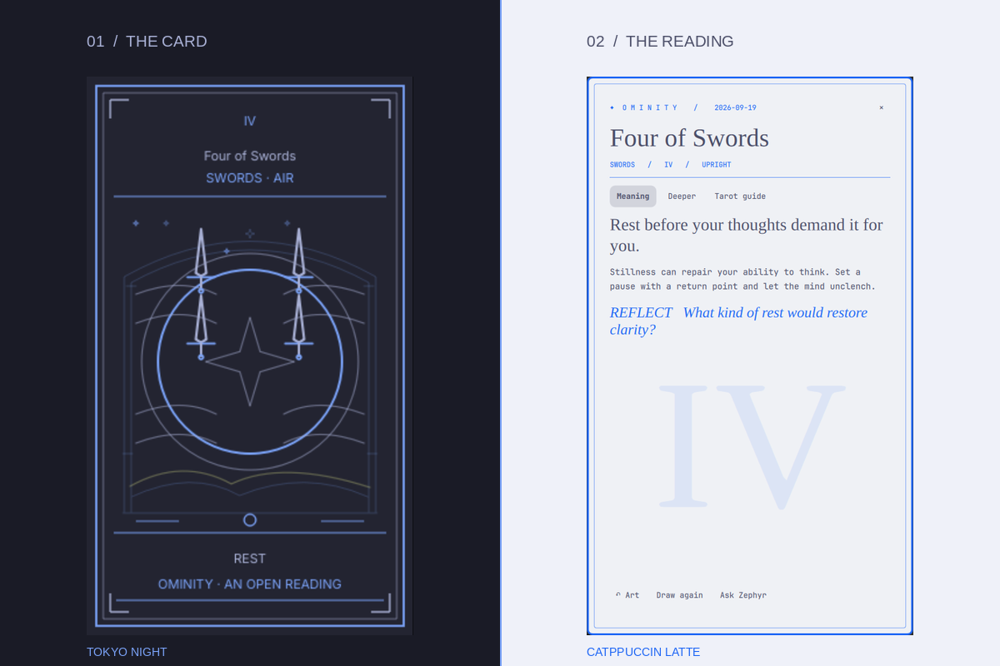

# Ominity



A daily tarot ritual for Omarchy. Click **✦** in the bar to draw a card. The artwork takes the whole stage; click the card to turn it over for its meaning, symbols, reflection, a deeper reading, and a guide to tarot. Click outside the card or press **Esc** to put it away. Right-click the bar glyph to toggle a compact desktop card.

Ominity draws once per local day and keeps that card until you deliberately choose **Draw again**. The 78 original SVG cards and their back redraw in the current Omarchy theme colors when the theme changes. Dark and light themes keep readable contrast and distinct suit accents. Theme variants are generated into a local cache; the bundled plates remain a fallback. No account, network connection, or model is needed.

[View the complete original deck](docs/deck-sheet.png) and its [card back](docs/card-back.png).

The deck uses the traditional [Rider–Waite–Smith structure](https://rider-waite.com/symbolism/pictorial-key-1-3/). Each card has an upright invitation, reversed angle, deeper interpretation, symbols, keywords, and a question. Research into Davide De Angelis’s *Starman Tarot* informed the broad themes of transformation and creative possibility ([Lo Scarabeo](https://www.loscarabeo.com/en/products/starman-tarot), [Schiffer](https://schifferbooks.com/products/starman-tarot-remastered-tarot-deck-and-guidebook-box-set)). Ominity’s art and text are original; it is unaffiliated with those creators or publishers.

## Install

On Omarchy, run:

```bash
omarchy plugin add https://github.com/0xQuan93/omarchy-ominity-plugin.git --enable
```

The plugin provides a bar widget and a persistent desktop service. Manage its bar position with Omarchy’s bar settings. To update or remove it:

```bash
omarchy plugin update oxquan.ominity
omarchy plugin remove oxquan.ominity
```

Removing the plugin leaves your private daily draw history in `~/.local/state/ominity/reading.json` until you choose to delete it. Theme variants live under `~/.cache/ominity/decks/` and can be deleted safely. The plugin uses Python’s standard library and Quickshell; no extra packages or external services are required on a current Omarchy installation.

## Optional local summary

An optional executable at `~/.config/ominity/summary` can provide a companion reflection. **Ask Zephyr** appears only when the adapter exists and runs only when clicked. The adapter reads the current card and returns one JSON object with `ok`, the same `drawnAt` stamp, and a `summary` string. Ominity ignores summaries for an older draw. The published plugin does not include a model, account integration, or private companion state.

Tarot here is a reflective practice: an image can prompt attention and choice, not establish facts or predict a fixed outcome.

## Development

`python3 -B deck/build_deck.py` regenerates the bundled SVG plates. `python3 -B -m unittest discover -s tests` checks draw behavior; `python3 -B -m unittest deck.test_deck deck.test_theme_deck` checks the deck and theme renderer. `omarchy plugin validate .` checks the manifest and entry points. `/usr/lib/qt6/bin/qmlformat -n Desktop.qml` (and the same for `CardOverlay.qml` and `BarWidget.qml`) parses QML. Live rendering on Omarchy is the final UI check.

License: MIT. See [LICENSE](LICENSE).
